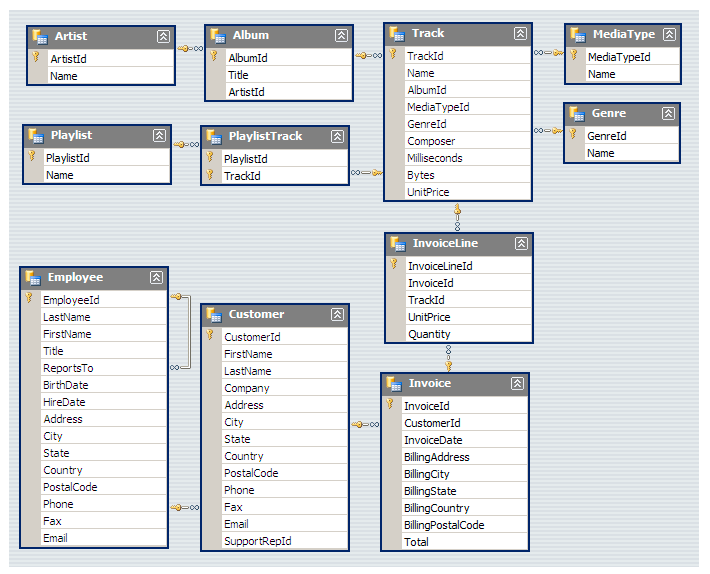

# SQL Music Store Analysis

Analysis of an online music store's sales database using PostgreSQL — 11 business questions answered across three difficulty tiers (basic aggregation, multi-table joins, and window functions/CTEs).

## Tools
- PostgreSQL
- VSCode + SQLTools

## Database Schema

11 tables covering customers, invoices, tracks, albums, artists, and genres.

## Key Findings

**Revenue & Customers**
- Highest revenue city: **Prague** ($273.24 total invoice value) — recommended location for a promotional event
- Top customer by spend: customer #5 (R. Madhav)

**Content & Genre**
- Most-represented rock artist in the catalog: **Led Zeppelin** (114 tracks), followed by U2 (112) and Deep Purple (92)
- Identified all customers who purchase Rock genre tracks (59 unique listeners)

**Advanced Analysis**
- Used `ROW_NUMBER() OVER (PARTITION BY ...)` window functions to find the top-spending customer *per country*, and the most popular genre *per country*, in a single query each — instead of running separate queries per country
- Used CTEs (`WITH ... AS (...)`) to break multi-step logic (e.g., "find the best-selling artist, then find who spent the most on that artist") into readable stages

## Questions Answered

**Easy**
1. Senior-most employee by job title
2. Countries with the most invoices
3. Top 3 invoice totals
4. City with highest total invoice revenue
5. Highest-spending customer

**Moderate**
1. Rock music listeners (email, name)
2. Top 10 rock artists by track count
3. Tracks longer than the average track length

**Advanced**
1. Customer spend on the best-selling artist
2. Most popular genre per country
3. Top-spending customer per country

## Files
- `Music_Store_Query.sql` — all queries with question context as SQL comments
- `Music_Store_database.sql` — PostgreSQL dump used to restore the database
- `MusicDatabaseSchema.png` — table relationship diagram
